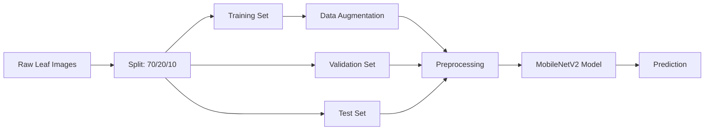
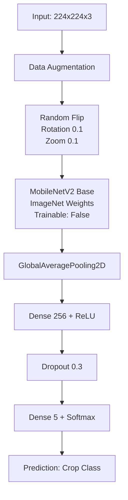
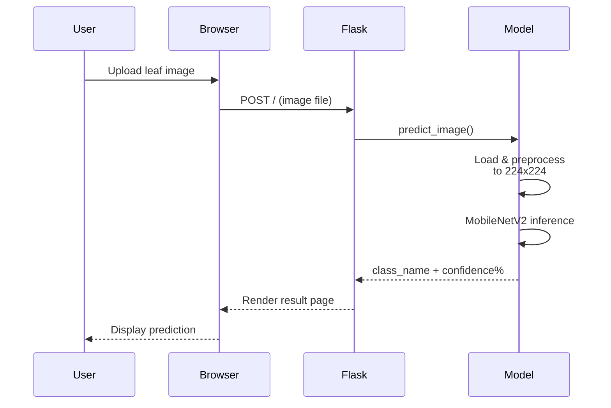

<div align="center">

# 🌿 Plant Leaf Disease Detection

**Deep learning-based crop leaf disease classifier using MobileNetV2**


---

**Detect diseases in crop leaves** — upload a leaf image and get instant predictions with confidence scores. Built with transfer learning on MobileNetV2 and served via a Flask web interface.

### 🎯 Supported Crops

| 🌾 Cotton | 🌽 Maize | 🫘 Pigeon Pea | 🫘 Soybean | 🎋 Sugarcane |
|:---------:|:--------:|:-------------:|:----------:|:-----------:|

</div>

---

## 📊 System Architecture

### 🔄 Data Pipeline



### 🧠 Model Architecture



### 🌐 Flask Web App Flow



---

## ⚙️ Installation

```bash
# Clone the repository
git clone https://github.com/yourusername/Plant_Leaf_Disease_Detection.git
cd Plant_Leaf_Disease_Detection

# Install dependencies
pip install -r requirements.txt

# Or using Pipenv
pipenv install
pipenv shell
```

### 📦 Dependencies

| Package      | Purpose                          |
|-------------|----------------------------------|
| `tensorflow` | Deep learning framework + MobileNetV2 |
| `flask`      | Web server for inference UI      |
| `numpy`      | Array/image processing           |

---

## 🚀 Usage

### 🧪 Run Inference (Single Image)

```bash
python test.py
```

Modify the image path in `test.py` to test your own leaf images.

### 🌐 Launch Web App

```bash
python main.py
```

Open **http://127.0.0.1:5000** in your browser, upload a leaf image, and get predictions instantly.

### 🏋️ Train from Scratch

```bash
# 1. Organize your dataset:
#    model_1_data/
#    ├── Cotton/
#    ├── Maize/
#    ├── Pigeon Pea/
#    ├── Soybean/
#    └── Suagrcane/

# 2. Split into train/valid/test:
python test_data_split.py

# 3. Train the model:
python model.py
```

---

## 📁 Project Structure

```
Plant_Leaf_Disease_Detection/
├── main.py                  # Flask web application
├── model.py                 # MobileNetV2 training script
├── test.py                  # Standalone inference script
├── test_data_split.py       # Dataset split utility
├── crop_class_names.json    # Trained class labels
├── new_model.keras          # Pre-trained model (~13 MB)
├── requirements.txt         # Python dependencies
├── Pipfile                  # Pipenv configuration
└── LICENSE                  # MIT License
```

---

## 🧪 Model Details

| Property          | Value                    |
|------------------|--------------------------|
| **Base Model**    | MobileNetV2              |
| **Input Size**    | 224 × 224 × 3            |
| **Weights**       | ImageNet (transfer learning) |
| **Trainable Base**| ❌ Frozen                |
| **Classifier**    | Dense(256) → Dropout(0.3) → Dense(5) |
| **Optimizer**     | Adam (lr = 1e-4)         |
| **Loss**          | Categorical Crossentropy |
| **Epochs**        | 8                        |
| **Batch Size**    | 32                       |
| **Classes**       | 5 crop types             |

---

## 📄 License

Distributed under the **MIT License**. See [`LICENSE`](./LICENSE) for more information.

---

<div align="center">

**Made with ❤️ by [Santhosh Gowda M](https://github.com/yourusername)** · © 2026

</div>
